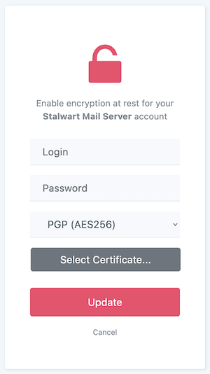
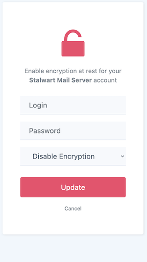

# Management

Stalwart Mail Server includes a web management interface that allows end users to control their own data security and independently manage encryption at rest for their accounts. This self-service interface allows users to enable or disable encryption without needing to involve or rely on the system administrator. To manage their encryption settings, users need to access the web management UI located under "/crypto" on the JMAP server base URL. For instance, if your JMAP server base URL is `https://jmap.example.org:8080`, then your users can access the encryption at rest management interface at `https://jmap.example.org:8080/crypto`.

## Enabling Encryption

To enable encryption at rest using the Stalwart Mail Server web interface, users are required to follow the below steps:

- Visit the encryption at rest management URL, which is typically in the format: "https://jmap.example.org:8080/crypto" (replace "jmap.example.org:8080" with your actual JMAP server base URL).
- In the provided form, enter your username and password. These credentials are the same as the ones you use to access your Stalwart Mail Server account.
- Choose the encryption method you wish to use - either OpenPGP or S/MIME. This choice depends on your specific encryption needs and the kind of key or certificate you have.
- Select and upload the file that contains your encryption key. For OpenPGP encryption, this would be your OpenPGP public key. For S/MIME encryption, this would be your S/MIME certificate.
- After ensuring all the details are correct, click on the "Update" button to submit the form.

Upon successful submission of the form, the system processes the information and, if everything is in order, it will enable encryption at rest for your account. A confirmation message will be displayed, indicating that encryption at rest has been successfully enabled. This message will also include the encryption method chosen and the number of certificates or keys that were successfully imported into the system.

 

After enabling encryption at rest, it is recommended to send a test email to yourself. This will help you verify that your email client is properly set up to decrypt the encrypted messages. When you receive this test email, it should arrive encrypted. Use your email client's decryption feature to decrypt the message. If you can successfully decrypt and read the message, it means that your email client is correctly configured to work with the encryption system in place.

Remember that, to decrypt messages, your email client must have access to the corresponding private key for the public key you've uploaded to the mail server (in case of OpenPGP), or the private key of your S/MIME certificate. Make sure these are properly installed and configured in your email client. If you encounter any issues or the message does not decrypt properly, double-check your email client's encryption settings and the key or certificate you uploaded to the Stalwart Mail Server. 

## Disabling Encryption

Disabling encryption at rest in Stalwart Mail Server is as straightforward as enabling it. Users who wish to disable encryption at rest would need to follow these steps:

- Access the web management UI through the designated URL (e.g., "https://jmap.example.org:8080/crypto"). 
- In the form provided, enter your username and password as required.
- In the encryption method dropdown menu, select the "Disable Encryption" option. 
- Click the "Update" button to apply the change. 

Once these steps have been successfully carried out, the system will then update the user's encryption settings. After the process, users will be redirected to a new screen where a confirmation message will be displayed, indicating that encryption at rest has been successfully disabled.

 

Remember that disabling encryption at rest means that new messages will be stored in plain text. Any messages that were encrypted when encryption was enabled will remain encrypted. Therefore, always consider the security implications of this action and ensure that you have a valid reason to disable encryption at rest.

Also note that even after disabling encryption at rest, you can re-enable it at any time by simply repeating the original steps and choosing either the OpenPGP or S/MIME option in the encryption method dropdown. However, this would only apply to new messages received after the re-enabling; previously received messages would not be retroactively encrypted.

